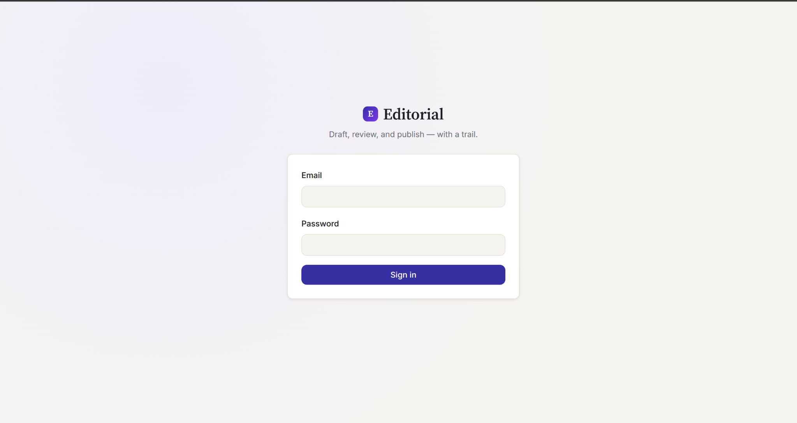
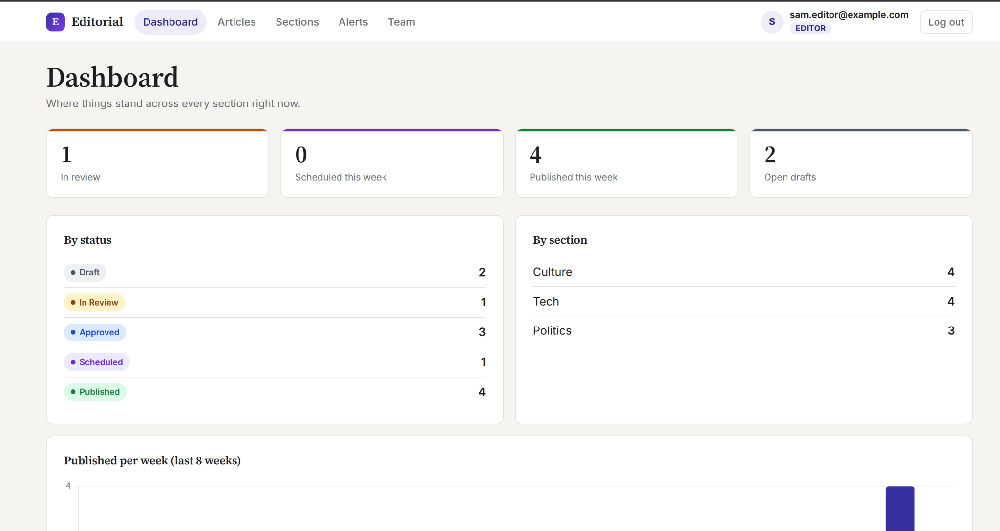
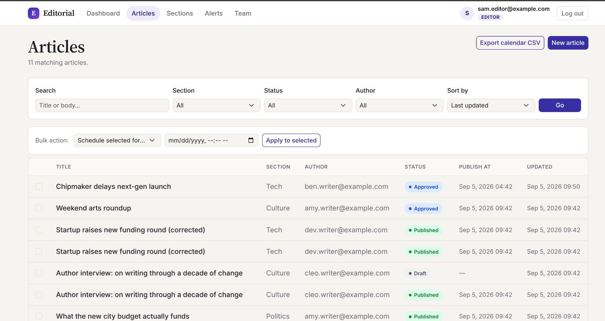
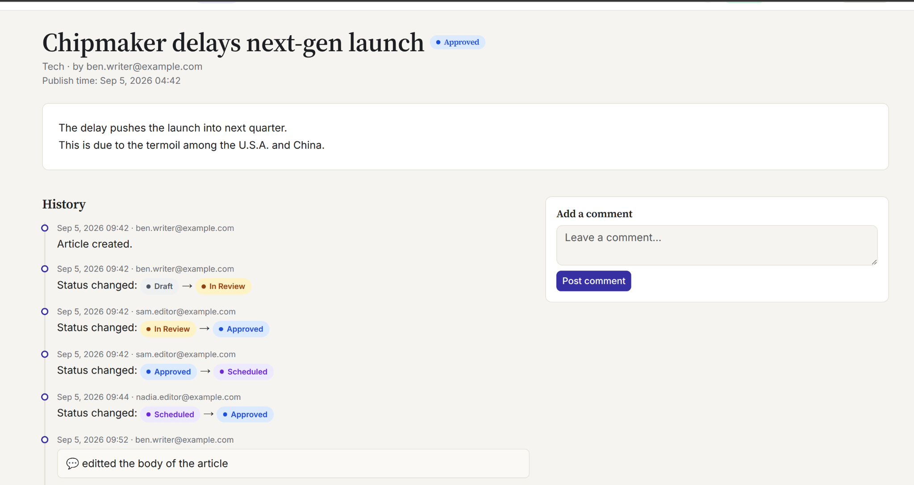
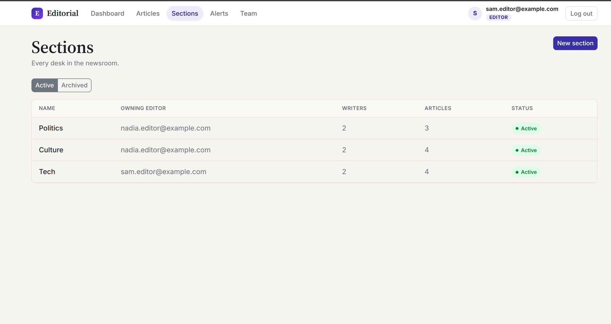
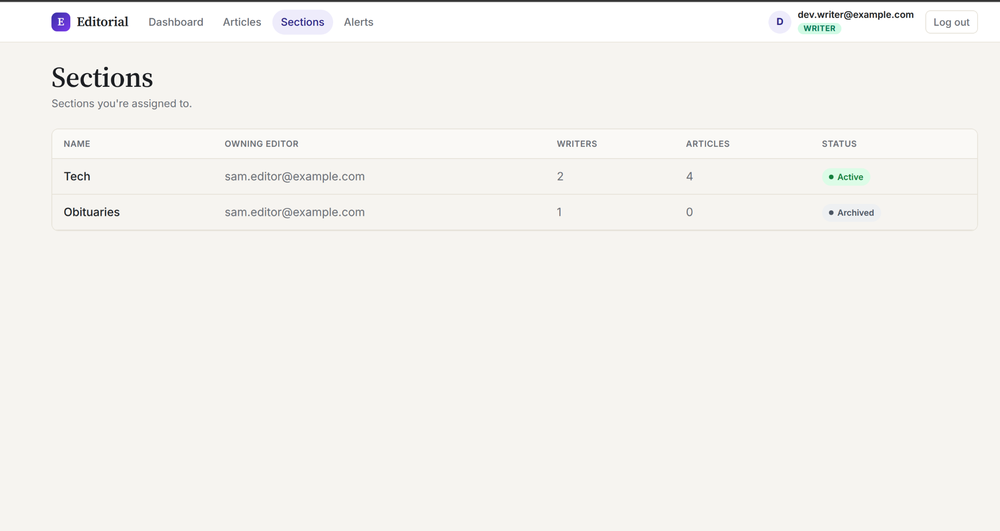
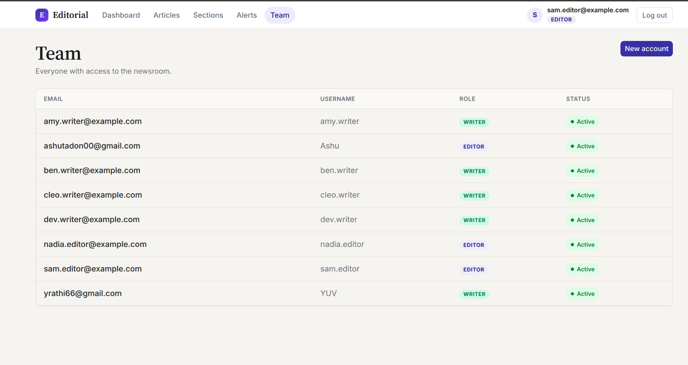

# Editorial Workflow

A small newsroom editorial system built around one simple problem: articles need to move through a proper review process, and every step should be visible afterwards.

Writers create articles inside the sections they are assigned to. Editors review and approve articles before they can be scheduled or published. Changes, comments, revisions and status transitions are kept in an append-only history so there is always a record of what happened.

**Live app:** https://editorial-workflow.vercel.app  
**Repository:** https://github.com/Ashu-Tandon21/busy_assess

The application is deployed on Vercel with PostgreSQL provided through Supabase.

> **Note:** The application is hosted on Vercel's free tier, so the first request after a period of inactivity can take a little longer because of a cold start.

---

## What it does

- Two roles: **Editor** and **Writer**, with permissions enforced on the server.
- Editors can create, edit, archive and restore sections.
- Each section has one owning editor and can have multiple assigned writers.
- Writers can only create and edit articles in sections assigned to them.
- Articles move through the lifecycle:
  **Draft → In Review → Approved → Scheduled → Published**
- A writer cannot approve their own article.
- Approved articles can either be published immediately or scheduled for a future time.
- Scheduled and published articles can be unpublished back to Approved.
- Editing an Approved or Scheduled article sends it back to In Review.
- Published articles cannot be directly edited. A writer has to create a new revision instead.
- Search, filtering, sorting and pagination are handled server-side.
- Articles can be scheduled or unpublished in bulk, with individual success/failure results.
- Scheduled and published articles can be exported as a CSV editorial calendar.
- Dashboard shows current workflow counts, section/status breakdowns and the last 8 weeks of publishing activity.
- Every article has an append-only history containing status changes, revisions and comments.
- Overdue scheduled articles generate alerts that can be dismissed by editors.

---

## Article workflow

The main workflow is:

```text
Draft
  ↓
In Review
  ↓
Approved
  ↓
Scheduled
  ↓
Published
```

There are also controlled paths for sending scheduled or published articles back to **Approved**.

One important rule is that the writer who created an article cannot approve it. Approval has to come from another editor.

For published content, editing does not directly modify the published article. Instead, a new revision is created and goes through the workflow separately. The existing published version remains unchanged until the revision itself is published.

---

## Screenshots

### Sign in

The application starts with a simple email/password login. The user's role is loaded from the server after authentication and determines which actions are available.



### Dashboard

The dashboard gives editors a quick view of the current newsroom state.

It shows:

- Articles currently in review
- Articles scheduled this week
- Articles published this week
- Open drafts
- Article count by status
- Article count by section
- Published articles per week for the last 8 weeks



### Articles

The article list provides the main place for finding and managing articles.

Search can be performed against the title or body, while the list can also be filtered by:

- Section
- Status
- Author

Articles can be sorted and paginated, and editors can perform bulk scheduling or unpublishing from the same page.

The page also includes an option to export the editorial calendar as CSV.



### Article history

Each article has its own detail page.

Along with the current article content and status, the page shows a permanent history of what happened to the article. Status changes show the previous and new status along with the user who made the change.

Comments are also kept as part of the article history.



### Sections — Editor view

Editors can manage the sections of the newsroom.

The editor view shows the owning editor, assigned writers, article count and whether a section is active or archived.

Editors can also create new sections and manage writer assignments.



### Sections — Writer view

Writers only see the sections they have been assigned to.

This keeps the writer's workspace limited to the desks they actually work with.



### Team

Editors can view the newsroom accounts and their roles.

The team page also provides the entry point for creating new accounts.



---

## Roles and permissions

### Editor

Editors can:

- Create, edit, archive and restore sections
- Assign writers to sections
- Review and approve articles
- Schedule articles
- Publish articles
- Unpublish scheduled/published articles
- Manage newsroom accounts
- View the full article history
- Dismiss overdue alerts

### Writer

Writers can:

- View sections assigned to them
- Create articles in their assigned sections
- Edit their own articles where the workflow allows it
- Submit drafts for review
- Create new revisions of published articles

Writers cannot approve or publish articles.

All of these permissions are checked on the server rather than relying only on what is displayed in the UI.

---

## Demo accounts

The deployed application includes seeded demo data.

| Role | Email | Password |
|---|---|---|
| Editor | `nadia.editor@example.com` | `DemoPass123!` |
| Editor | `sam.editor@example.com` | `DemoPass123!` |
| Writer | `amy.writer@example.com` | `DemoPass123!` |
| Writer | `ben.writer@example.com` | `DemoPass123!` |
| Writer | `cleo.writer@example.com` | `DemoPass123!` |
| Writer | `dev.writer@example.com` | `DemoPass123!` |

The different accounts can be used to see how the application changes depending on the user's role and section assignments.

---

## Running locally

Clone the repository:

```bash
git clone https://github.com/Ashu-Tandon21/busy_assess.git
cd busy_assess
```

Create and activate a virtual environment:

```bash
python -m venv venv
source venv/bin/activate
```

Install the dependencies:

```bash
pip install -r requirements.txt
```

Run the migrations:

```bash
python manage.py migrate
```

Load the demo data:

```bash
python manage.py seed_demo
```

Start Django:

```bash
python manage.py runserver
```

The application will then be available at:

```text
http://127.0.0.1:8000/
```

SQLite is used locally by default, so no separate database setup is required for local development.

If required, the application can also be configured to use PostgreSQL through the environment variables described in `.env.example`.

---

## Tech stack

| Layer | Technology |
|---|---|
| Backend | Django 5.2 |
| Frontend | Django Templates, Bootstrap 5, Chart.js |
| Database | PostgreSQL with Supabase in production |
| Local database | SQLite |
| Testing | Django test framework |
| Hosting | Vercel |

Bootstrap and Chart.js are loaded through CDN rather than being bundled into the application.

---

## Project structure

```text
busy_assess/
├── accounts/          # User model, authentication and roles
├── articles/          # Articles, workflow, history and alerts
├── sections/          # Sections and writer assignments
├── templates/         # Django templates
├── static/            # Static assets
├── docs/              # Project documentation
├── config/            # Django project configuration
├── manage.py
├── requirements.txt
└── README.md
```

---

## Database and history

The main application data is split into users, sections, section assignments and articles.

Articles also have supporting records for:

- Status changes
- Comments
- Revisions
- Alert dismissals

The article history is append-only. Existing history entries are not edited or deleted, including by editors.

This makes it possible to look back at an article and see how it moved through the workflow and who performed each action.

---

## Testing

The project includes tests covering the main workflow and permission rules, including:

- Article lifecycle transitions
- Writer/editor permissions
- Section assignments
- Revisions
- Publishing and unpublishing
- Bulk actions
- Alerts
- Dashboard-related behaviour

The test suite can be run with:

```bash
python manage.py test
```

---

## Deployment

The production application is deployed on **Vercel**.

The production database uses **Supabase PostgreSQL**, with database credentials and Django configuration supplied through environment variables rather than being committed to the repository.

The deployment also runs the Django database migrations and seeds the demo data when required.

---

## Documentation

The `docs/` folder contains the supporting project documentation:

- `architecture.md` — application structure and major components
- `schema.md` — database model and relationship details
- `plan.md` — implementation plan
- `decisions.md` — important technical/design decisions
- `ai-prompts.md` — AI prompts and usage during development
- `SUBMISSION.md` — requirement-by-requirement submission notes

---

## Notes

This project was built as a take-home assessment focused on implementing the editorial workflow rather than building a full production newsroom platform.

The main design goal was to keep the workflow rules explicit and enforce them on the server, while keeping the interface simple enough for an editor or writer to understand what they can do at each stage.
